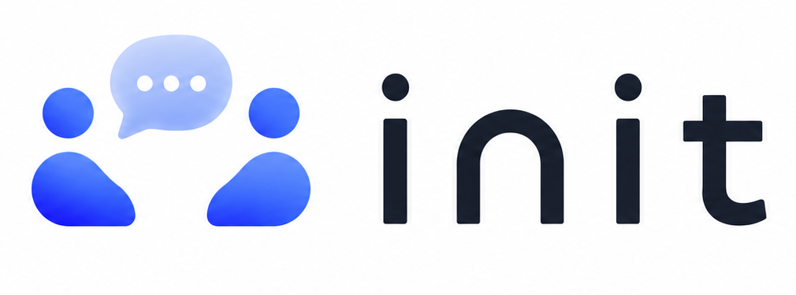

# init · 디자인 시스템 가이드

> **init** — "인터뷰를 잇다". AI 면접 플랫폼.
> 본 문서는 인증·공통 화면(랜딩 / 로그인 / 회원가입 / 비밀번호 재설정)을 기준으로 정리한 디자인 시스템입니다. 이후 모든 화면은 이 토큰과 패턴을 따릅니다.

---

## 1. 무드 & 원칙

- **흰 배경 + 인디고/바이올렛 글로우.** 밝고 깨끗한 화이트 캔버스 위에 보라빛 라디얼 글로우로 트렌디한 에너지를 더합니다.
- **젊고 모던하게.** 큰 타이포그래피, 넉넉한 여백, 부드러운 그라데이션, pill(완전 둥근) 버튼.
- **절제.** 색은 한 계열(인디고→블루)만 강조색으로 쓰고 나머지는 무채색. 장식보다 콘텐츠.
- **신뢰감.** AI 평가 플랫폼인 만큼 과하지 않고 정돈된 인상.

---

## 2. 컬러 토큰

### Brand (강조)
| 토큰 | 값 | 용도 |
|---|---|---|
| `--brand-1` | `#6E5BF6` | 메인 인디고 (그라데이션 시작) |
| `--brand-2` | `#5B8CFF` | 블루 (그라데이션 끝) |
| `--brand-strong` | `#5B57F2` | 단색 인디고 (세그먼트 활성 텍스트 등) |
| `--brand-grad` | `linear-gradient(120deg,#6E5BF6,#5B8CFF)` | 주요 버튼·강조 요소 |
| `--brand-soft` | `#EEEDFB` | 연한 보라 배경 (배지, 아이콘 칩) |

### Ink (텍스트)
| 토큰 | 값 | 용도 |
|---|---|---|
| `--ink-900` | `#14131C` | 헤드라인 / 최강조 |
| `--ink-800` | `#16151F` | 제목 |
| `--ink-700` | `#3A384A` | 라벨 |
| `--ink-500` | `#5C5A6C` | 본문 |
| `--ink-400` | `#6A6878` | 보조 본문 |
| `--ink-300` | `#807E8E` | 캡션 |
| `--ink-200` | `#A7A4B8` | placeholder / 비활성 |

### Surface & Line
| 토큰 | 값 | 용도 |
|---|---|---|
| `--bg` | `#FFFFFF` | 기본 배경 |
| `--bg-tint` | `linear-gradient(180deg,#F7F6FF 0%,#FBFAFF 38%,#fff 100%)` | 인증 화면 배경 |
| `--surface-soft` | `#F6F5FD` | 미니 UI 카드 안쪽 |
| `--line` | `#E5E3F0` | 인풋 보더 |
| `--line-soft` | `#ECEBF3` | 카드 보더 / 디바이더 |

### Glow (라디얼)
```css
/* 히어로 글로우 */
background: radial-gradient(closest-side,
  rgba(123,107,255,.40), rgba(91,140,255,.18) 48%, transparent 72%);
filter: blur(14px);
```
보조 글로우는 `rgba(123,107,255,.22)` / `rgba(91,170,255,.20)` 사용.

---

## 3. 타이포그래피

- **본문 서체:** `Pretendard` (Variable). `-apple-system` 폴백.
- **모노 악센트:** `JetBrains Mono` — 영문 라벨(예: `AI INTERVIEW PLATFORM`, `AI REPORT`)에만 소량 사용. `letter-spacing:.22em` + 대문자.

| 역할 | size / weight / line | letter-spacing |
|---|---|---|
| Hero (H1) | 84px / 800 / 1.0 | -.05em |
| Section (H2) | 46px / 800 | -.03em |
| 카드 제목 (H3) | 19–21px / 700 | — |
| 카드 소제목 (H4) | 17px / 700 | — |
| 폼 제목 | 24–25px / 800 | -.02em |
| 본문 | 15–18px / 400 / 1.6 | — |
| 라벨 | 13px / 600 | — |
| 캡션·모노라벨 | 12px / 600 | .22em (모노만) |

**그라데이션 텍스트** (강조 단어):
```css
background: linear-gradient(120deg,#6E5BF6,#5B8CFF);
-webkit-background-clip:text; background-clip:text; color:transparent;
```

---

## 4. 스페이싱 & 라운딩

- **라운딩:** 인풋/버튼 `11–12px` · 카드 `18–24px` · pill 버튼·배지 `999px` · 클로징 배너 `28px`.
- **컨테이너 최대폭:** 랜딩 `1240px`(nav)/`1160px`(콘텐츠) · 폼 카드 `444–560px`.
- **섹션 상하 여백:** 64–96px 리듬.
- **그림자:**
  - 카드: `0 12px 36px rgba(20,18,45,.05)`
  - 폼 카드: `0 24px 64px rgba(40,30,90,.10)`
  - 강조 버튼: `0 10px 26px rgba(91,110,246,.32)`

---

## 5. 핵심 컴포넌트

### 로고
공식 로고 이미지를 사용합니다 — **`assets/logo-init.png`** (1010×375, PNG).



- **구성:** 좌측 심볼(두 사람 + 말풍선 "···") + 우측 워드마크 `init`(다크 잉크 `#16151F` 계열).
- **심볼 의미:** 두 사람을 잇는 대화 = "인터뷰를 잇다". 말풍선·인물에 인디고→블루 그라데이션 사용 → 브랜드 컬러와 일치.
- **사용 규칙**
  - 흰/밝은 배경 위에 사용. 어두운 배경이 필요하면 흰색 반전 버전을 별도 제작.
  - 최소 폭 약 88px 이상(워드마크 가독성 확보), 좌우 여백은 심볼 높이의 ~30% 확보.
  - 비율 고정(1010:375). 임의로 늘리거나 색을 바꾸지 않습니다.
  - 아이콘만 필요한 자리(파비콘·앱 아이콘 등)에는 좌측 **심볼만** 잘라서 사용.
- **구현 예시**
  ```html
  
  ```

### 버튼
- **Primary:** `--brand-grad` 배경, 흰 텍스트, 600, 강조 그림자. (메인 액션)
- **Dark:** `#16151F` 배경, 흰 텍스트, pill. (랜딩 nav·히어로 CTA)
- **Secondary:** 흰 배경 + `--line` 보더, `#2A2836` 텍스트. hover `#FAFAFC`.
- 높이: 폼 버튼 50px / pill CTA 패딩 `14px 28px`.

### 입력 필드
높이 48px, 보더 `--line`, 라운딩 11px. **포커스:**
```css
border-color:#7E7EFF; box-shadow:0 0 0 3px rgba(110,91,246,.14);
```
비밀번호 필드는 우측에 "보기/숨기기" 토글 텍스트(`--brand-1`, 600 13px).

### 세그먼트 토글 (기업/지원자)
`#F4F3FB` 트랙 + 활성 탭은 흰 배경 + `#5B57F2` 텍스트 + 미세 그림자.

### 선택 카드 (회원가입 유형)
기본: 흰 배경 + `#EAE9F2` 보더. **선택 시:** `#F4F3FE` 배경 + `#6E5BF6` 1.5px 보더 + `0 12px 30px rgba(91,87,242,.16)` 그림자 + 우상단 그라데이션 체크 뱃지.

### 미니 UI 카드 (랜딩 "무엇을 하나요")
실제 제품 UI를 축소해 보여줌 — 채팅 버블, 역량 평가 막대그래프. 안쪽 면은 `--surface-soft`.
- 채팅: AI 버블(흰 배경+보더, 좌상단 각짐) / 사용자 버블(`--brand-grad`, 우상단 각짐) / "답변 녹화 중" 펄스 점.
- 리포트: 7px 높이 막대, 트랙 `#E9E7F5`, 채움 `--brand-grad`.

### 클로징 배너
`linear-gradient(120deg,#5B57F2,#6E7BFF 55%,#5B8CFF)` 풀컬러 + 하단 화이트 글로우. 흰 텍스트, 흰 pill 버튼(텍스트 `#5B57F2`).

---

## 6. 모션

```css
@keyframes initpulse { 0%,100%{opacity:1;transform:scale(1)} 50%{opacity:.3;transform:scale(.8)} }   /* 녹화 점 */
@keyframes initdrift { 0%,100%{transform:translate(-50%,0)} 50%{transform:translate(-50%,-26px)} }     /* 히어로 글로우 떠다님 9s */
@keyframes initdrop  { from{opacity:0;transform:translateY(-6px)} to{opacity:1;transform:translateY(0)} } /* GNB 호버 드롭다운 .16s */
```
- 호버 전환: `transition:.15s`.
- 버튼 hover: `opacity:.92`(그라데이션) 또는 배경 톤 변화.

---

## 7. 간격 & 그리드 규칙

- **간격 스케일(4px 베이스):** `4 · 8 · 12 · 16 · 20 · 24 · 32 · 40 · 48 · 64 · 80 · 96`px. 이 외 값은 쓰지 않습니다.
  - 요소 내부 컴포넌트 간: 8–16px · 카드 패딩: 24–38px · 섹션 간: 64–96px.
- **콘텐츠 최대폭:** 마케팅/랜딩 `1160px` · 앱 내부 본문 `1200px` · 폼/단일 카드 `444–680px`. 좌우 거터 `24–32px`.
- **앱 그리드:** 12컬럼 기준, gutter `18px`. 카드 그리드는 `repeat(N,1fr)` + `gap:18px`.
- **반응형 브레이크포인트:**
  | 이름 | 폭 | 동작 |
  |---|---|---|
  | `sm` | < 640px | 1컬럼, GNB는 햄버거 메뉴(전체화면 오버레이) |
  | `md` | 640–1024px | 2컬럼, GNB 가로 유지(필요 시 일부 메뉴 축약) |
  | `lg` | > 1024px | 풀 레이아웃(GNB + 12컬럼) |
- 터치 타깃 최소 44px, 본문 최소 14px.

---

## 8. 앱 레이아웃 골격 (로그인 이후 내부 페이지)

인증 화면은 "중앙 카드형"이고, 로그인 후 내부 페이지는 **상단 GNB(전역 네비) + 본문** 구조입니다. 좌측 사이드바(SNB)는 사용하지 않습니다. 1차 메뉴는 GNB에 가로로 놓이고, 2차 메뉴는 **호버 시 아래로 펼쳐지는 드롭다운(메가 메뉴)** 으로 노출합니다.

```
┌──────────────────────────────────────────────┐
│  GNB (64px)  로고  채용관리 지원자 리포트 …  🔔 ◉ │
├──────────────────────────────────────────────┤   ▢ 호버 시 1차 메뉴 아래로
│  Page header (제목 + 액션)                      │      드롭다운이 펼쳐짐
│  ────────────────────────────────────────     │
│  Content (max 1200px, 좌우 거터 32px)           │
└──────────────────────────────────────────────┘
```

### GNB (상단 전역 네비)
- 높이 `64px`, 배경 `#FFFFFF`, 하단 보더 `--line-soft`, `position:sticky; top:0`. 내부 페이지라 **글로우 없음**.
- 좌측: 로고(`assets/logo-init.png`, height 26–28px). 로고와 1차 메뉴 사이 간격 `40px`.
- 중앙/좌: 1차 메뉴 항목을 가로 나열(`gap:4px`). 각 항목 높이 64px(GNB와 동일)·패딩 `0 14px`·폰트 `14.5px/600`.
  - 기본 텍스트 `--ink-500`. hover/활성 텍스트 `--brand-strong`(`#5B57F2`).
  - **활성 1차 메뉴:** 항목 하단에 2px `--brand-grad` 언더라인(GNB 바닥에 붙임).
  - 하위 메뉴가 있는 항목은 라벨 우측에 작은 ⌄ 캐럿(8px). hover 시 180° 회전.
- 우측: 알림 벨(38px 라운드 버튼) + 프로필 아바타(38px 원형, `--brand-grad`).

### 호버 드롭다운 (메가 메뉴)
- 트리거: 1차 메뉴 항목에 마우스 호버. **트리거 + 패널을 한 래퍼로 감싸** 패널 위로 이동해도 닫히지 않게 함(마우스가 래퍼를 벗어나면 닫힘). 키보드 포커스 시에도 열림.
- 패널: GNB 바로 아래 부착(`top:64px`). 흰 배경, 라운딩 `14px`, 보더 `--line-soft`, 그림자 `0 16px 40px rgba(20,18,45,.12)`, 패딩 `10px`. 좌측 정렬(트리거 시작점 기준), 최소폭 `220px`.
- 항목: 높이 `40px`, 라운딩 `10px`, 패딩 `0 12px`, 폰트 `14px/500` `--ink-700`. hover 배경 `#F6F5FD` + 텍스트 `--brand-strong`. 필요 시 좌측 아이콘 + 우측 보조설명(12px/`--ink-300`).
- 넓은 메뉴(메가)는 패널 안에서 2–3컬럼 그리드(`gap:4px 24px`)로 묶고, 그룹 제목(11px/600/`--ink-200`, 대문자)을 위에 둡니다.
- 모션: 열림 `opacity 0→1 / translateY(-6px→0)` `.16s`. (드롭다운 키프레임은 §6 참고)

### 페이지 헤더
- GNB 아래 본문 최상단. 좌측: 페이지 제목(24px/800, -.02em) + 보조 설명(14px/`--ink-300`). 우측: 1차 액션 버튼(Primary).
- 하위 탭이 있으면 헤더 아래 탭 바 배치.

> **모바일(sm):** GNB 1차 메뉴는 햄버거 버튼으로 접고, 탭하면 전체화면 메뉴(아코디언으로 2차 메뉴 펼침)로 대체합니다. 호버가 없는 환경이므로 **탭으로 열고 닫습니다.**

---

## 9. 데이터 표시 & 피드백 컴포넌트

### 상태 칩(Badge)
높이 24–26px, 라운딩 999px, 폰트 12px/600. 색은 의미별 soft 배경 + 진한 텍스트.
| 의미 | 배경 | 텍스트 |
|---|---|---|
| 진행/정보 (info) | `#EEEDFB` | `#5B57F2` |
| 완료/성공 (success) | `#E4F7EC` | `#1F8A5B` |
| 대기/주의 (warning) | `#FFF3DC` | `#9A6A00` |
| 실패/위험 (danger) | `#FCE8E8` | `#C8392F` |
| 중립 (neutral) | `#F1F0F6` | `#6A6878` |

### 테이블
- 헤더: 배경 `#FBFAFF`, 텍스트 12.5px/600 `--ink-400`, 하단 보더 `--line-soft`.
- 행: 높이 56px, 셀 14px/400 `--ink-700`, 행 구분 보더 `--line-soft`, hover `#FBFAFF`.
- 라운딩: 표 전체를 16px 카드로 감싸고 `overflow:hidden`. 우측 끝 액션은 케밥(⋯) 또는 텍스트 버튼.
- **리스트(모바일)**: 표 대신 카드 리스트로 — 각 항목 카드(보더 `--line-soft`, 라운딩 14px, 패딩 16px).

### 통계/지표 카드 (KPI)
흰 카드(`0 6px 20px rgba(20,18,45,.04)`), 라벨(13px/`--ink-300`) + 수치(28–32px/800 `--ink-900`) + 증감 칩(success/danger).

### 모달 / 다이얼로그
- 오버레이 `rgba(16,15,31,.45)` + `backdrop-filter:blur(2px)`.
- 패널: 흰 배경, 라운딩 20px, 패딩 28–32px, 그림자 `0 24px 64px rgba(40,30,90,.18)`, 최대폭 `480–560px`.
- 헤더(제목 20px/800) + 본문 + 우하단 액션(Secondary + Primary).

### 토스트(알림)
우상단 또는 하단중앙. 흰 카드 + 좌측 상태 컬러 도트 + 텍스트 14px. 라운딩 12px, 그림자 `0 10px 30px rgba(20,18,45,.12)`. 3–4초 후 페이드.

### 빈 화면 (Empty state)
중앙 정렬: 연한 보라 원형 아이콘 칩(`--brand-soft`) + 제목(17px/700) + 안내(14px/`--ink-300`) + 1차 액션 버튼.

### 탭
하단 보더 트랙(`--line-soft`) 위에 활성 탭만 `--brand-strong` 텍스트 + 2px 인디고 언더라인. 비활성 `--ink-400`.

### 폼 보조 상태
- 에러: 인풋 보더 `#E5897F`, 하단 헬퍼 텍스트 12.5px `#C8392F`.
- 성공: 보더 `#7FC8A4`. 비활성: 배경 `#F6F5FD`, 텍스트 `--ink-200`, 커서 `not-allowed`.

---

## 10. 화면 목록 (인증·공통 1–6)

| # | 화면 | 핵심 |
|---|---|---|
| 01 | 랜딩 | 히어로 + 워터마크 밴드 + "무엇을 하나요"(미니 UI 카드 2 + 특징 3) + 클로징 배너 |
| 02 | 로그인 | 기업/지원자 세그먼트, 이메일·비번, ID/PW 찾기, Google 로그인 |
| 03 | 회원가입 유형 선택 | 기업 / 지원자 선택 카드 → 다음 |
| 04 | 지원자 회원가입 | 이름·이메일(인증코드)·비번·약관 |
| 05 | 기업 회원가입 | 담당자·회사명·이메일(인증코드)·비번·약관 |
| 06 | 비밀번호 재설정 | 이메일 인증 → 새 비밀번호 |

> 화면 하단 중앙의 다크 pill 스위처는 **검토용 네비게이션**입니다. 실제 배포 시 제거하세요.

---

## 11. 구현 메모

- 단일 파일 `init 인증·공통 (1-6).dc.html` 에 6개 화면을 상태(`screen`)로 전환하며 구현. 모든 스타일은 인라인.
- 강조색은 항상 그라데이션(`--brand-grad`) 우선, 단색이 필요하면 `#5B57F2`/`#6E5BF6`.
- 새 화면 추가 시: 화이트 배경 → `--bg-tint` 글로우 → 카드(`0 24px 64px` 그림자) → 인풋/버튼 토큰 그대로 재사용.
- **글로우 사용 범위:** 랜딩·인증 등 진입 화면 **전용**. 로그인 후 내부 페이지는 깨끗한 흰 배경(글로우 없음) + 상단 GNB 레이아웃.
- **지양:** 다크 배경, 과한 그라데이션 남발, 둥근 모서리+좌측 보더 액센트 박스, 이모지(브랜드 요소 아님).

---

## 체크리스트 — 새 페이지 만들 때

- [ ] 내부 페이지면 상단 GNB(64px) + 본문(max 1200px) 골격을 따랐는가 (좌측 사이드바 금지)
- [ ] 하위 메뉴는 GNB 호버 드롭다운으로 노출했는가 (트리거+패널 한 래퍼로 묶어 끊김 방지)
- [ ] 강조 요소에 `--brand-grad`를 썼는가 (단색 남용 X)
- [ ] 간격이 4px 스케일(8/12/16/24/32…) 안에 있는가
- [ ] 상태 표현에 §9 Badge 색 규칙을 썼는가
- [ ] 인풋 포커스 링(`rgba(110,91,246,.14)`), 버튼 그림자 토큰을 재사용했는가
- [ ] 내부 페이지에 글로우를 넣지 않았는가
- [ ] 로고는 `assets/logo-init.png`를 비율 고정해 썼는가
