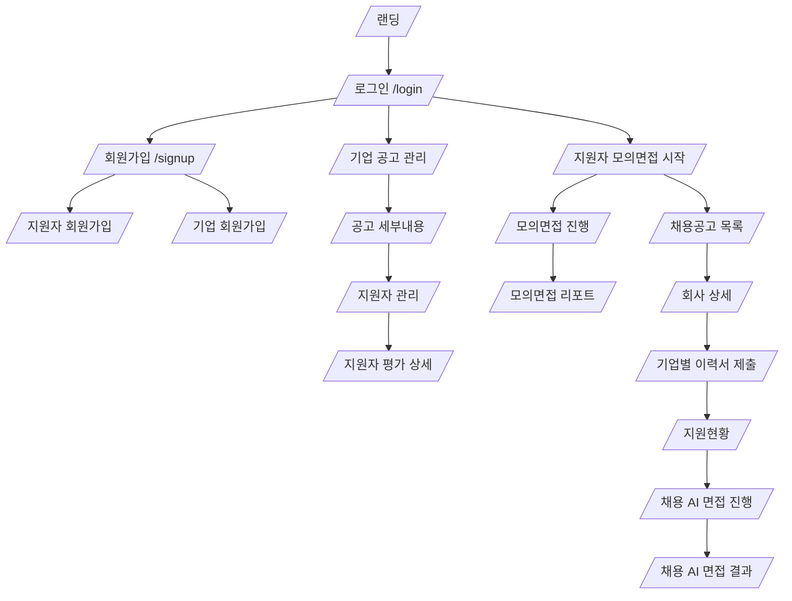

# Screen Flow

> Source: `init/docs/00_source` 기준. Generated at 2026-06-27.

와이어프레임의 화면 경로와 주요 전환을 포털별로 정리한다.

## Frontend Feature Baseline

Next.js route는 `frontend/src/app`에 두고, 화면별 구현 코드는 `frontend/src/features` 아래 도메인 폴더에 둔다. 같은 화면의 component, hook, client helper는 해당 feature 폴더 안에서 먼저 해결하고 공통화가 필요한 경우에만 `frontend/src/shared`로 이동한다.

| Feature Folder | Owns Routes | Primary Owner |
| --- | --- | --- |
| `frontend/src/features/auth` | `/login`, `/signup`, `/signup/candidate`, `/signup/company`, `/password/reset` | A |
| `frontend/src/features/company-recruiting` | `/company/applications/dashboard`, `/company/recruitments`, `/company/recruitments/{recruitmentId}`, `/company/recruitments/{recruitmentId}/applicants` | B |
| `frontend/src/features/company-interview-criteria` | `/company/interviews/settings` | C |
| `frontend/src/features/company-profile` | `/company/mypage` | A/B |
| `frontend/src/features/candidate-application-interview` | `/candidate/jobs`, `/candidate/jobs/{jobId}`, `/candidate/jobs/{jobId}/apply`, `/candidate/applications`, `/candidate/applications/{applicationId}/interview`, `/candidate/applications/{applicationId}/report`, `/candidate/mypage` | D |
| `frontend/src/features/ai-report` | 기업/지원자 리포트 상세, 리포트 상태 표시, AI 처리 상태 표시 component | E |

금지 패턴: 새 화면을 `frontend/src/app` 아래에 모든 로직까지 직접 구현하지 않는다. `app`은 routing/layout 경계로 유지하고, 실제 기능 구현은 feature folder에 둔다.

## High-Level Flow

## Screen Catalog

| Screen | Path | Actor | Depth | Linked API/Route |
| --- |--- |--- |--- |--- |
| 랜딩 화면 | / | 공통 |  | /login |
| 로그인 화면 | /login | 공통 | 로그인 | POST /auth/login / /password/reset / /signup / GET /auth/google (지원자 전용) |
| 회원가입 화면 | /signup | 공통 | 회원가입 |  |
| 지원자 회원가입 화면 | /signup/candidate | 공통 | 회원가입 | POST /auth/signup/candidate / POST /auth/email/send-code / POST /auth/email/verify-code |
| 기업 회원가입 화면 | /signup/company | 공통 | 회원가입 | POST /auth/signup/company / POST /auth/email/send-code / POST /auth/email/verify-code |
| 비밀번호 재설정 화면 | /password/reset | 공통 | 로그인 | POST /auth/password/reset / POST /auth/password/send-code / POST /auth/password/verify-code |
| 공고 관리 화면 | /company/applications/dashboard | 기업 | 지원현황 (GNB button) | GET /company/dashboard / GET /company/recruitments / PATCH /company/applicants/{applicantId}/screening-status |
| 공고 세부내용 화면 | /company/recruitments/{recruitmentId} | 기업 | 지원현황 (GNB button) | GET /company/recruitments/{recruitmentId} |
| 지원자 관리 화면 | /company/recruitments/{recruitmentId}/applicants | 기업 | 지원현황 (GNB button) | GET /company/recruitments/{recruitmentId}/applicants / POST /company/applicants / POST /company/applicants/invitations / POST /company/interview-sessions / GET /company/applicants / GET /company/reports |
| 지원자 평가 상세 화면 | /company/applicants/{applicantId}/evaluation | 기업 | 지원현황 (GNB button) | GET /company/applicants/{applicantId}/evaluation / GET /company/applicants/{applicantId}/document-evaluation / GET /company/reports/{reportId} / GET /company/reports/{reportId}/evidence / GET /company/reports/{reportId}/media / GET /company/applicants/compare / PATCH /company/applicants/{applicantId}/manual-evaluation / GET /company/reports/{reportId}/download / POST /reports/{reportId}/evaluation-context / POST /reports/{reportId}/answer-evaluation / POST /reports/{reportId}/communication-analysis / POST /reports/{reportId}/generate |
| 채용 공고 관리 화면 | /company/recruitments | 기업 | 채용관리 (GNB button) | GET /company/recruitments / GET /company/recruitments?keyword={keyword}&status={status} / /company/recruitments/{recruitmentId} / /company/recruitments/{recruitmentId}/edit / POST /company/recruitments/{recruitmentId}/copy |
| 면접 관리 화면 | /company/interviews/settings | 기업 | 채용관리 (GNB button) | GET /company/interviews/settings / POST /company/interviews/evaluation-criteria/suggest / PATCH /company/interviews/evaluation-criteria / POST /company/interviews/questions / POST /company/interviews/questions/generate / POST /company/interviews/question-sets / PATCH /company/interviews/time-policy |
| 회사 정보 관리 화면 | /company/mypage | 기업 | 회사 정보 관리 (GNB button) | PATCH /company/profile / POST /company/profile/logo / PATCH /company/notifications/settings |
| AI 모의면접 시작 화면 | /candidate/mock-interview/start | 지원자 | AI 모의면접 (GNB button) | POST /candidate/mock-interviews / POST /candidate/mock-interviews/questions/generate |
| AI 모의면접 진행 화면 | /candidate/mock-interviews/{sessionId} | 지원자 | AI 모의면접 (GNB button) | GET /candidate/mock-interviews/{sessionId} / GET /candidate/mock-interviews/{sessionId}/questions / POST /candidate/mock-interviews/{sessionId}/answers / POST /candidate/mock-interviews/{sessionId}/next-question / POST /candidate/mock-interviews/{sessionId}/stt / POST /candidate/mock-interviews/{sessionId}/follow-up-question / PATCH /candidate/mock-interviews/{sessionId}/complete |
| 모의면접 평가 리포트 화면 | /candidate/mock-interview/reports | 지원자 | AI 모의면접 (GNB button) | GET /candidate/mock-interview/reports / GET /candidate/mock-interviews/history |
| 모의면접 평가 리포트 화면 | /candidate/mock-interview/reports/{reportId} | 지원자 | AI 모의면접 (GNB button) | GET /candidate/mock-interview/reports/{reportId}/feedback / GET /candidate/mock-interview/reports/{reportId}/media / POST /candidate/mock-interview/reports/{reportId}/generate |
| 회사 리스트 화면 | /candidate/jobs | 지원자 | 채용정보 (GNB button) | GET /candidate/jobs |
| 회사 상세 화면 | /candidate/jobs/{jobId} | 지원자 | 채용정보 (GNB button) | GET /candidate/jobs/{jobId} / /candidate/jobs/{jobId}/apply |
| 기업별 이력서 제출 화면 | /candidate/jobs/{jobId}/apply | 지원자 | 채용정보 (GNB button) | POST /candidate/jobs/{jobId}/applications |
| 지원현황 화면 | /candidate/applications | 지원자 | 채용정보 (GNB button) | GET /candidate/applications / GET /candidate/applications/{applicationId}/interview-guide / POST /candidate/applications/{applicationId}/consent / POST /candidate/interviews/{sessionId}/device-check / POST /candidate/applications/{applicationId}/interview/start |
| 채용 AI 면접 진행 화면 | /candidate/applications/{applicationId}/interview | 지원자 | 채용정보 (GNB button) | GET /candidate/applications/{applicationId}/interview / GET /candidate/interviews/{sessionId}/questions / POST /candidate/interviews/{sessionId}/answers / POST /candidate/interviews/{sessionId}/next-question / POST /candidate/interviews/{sessionId}/stt / POST /candidate/interviews/{sessionId}/follow-up-question / PATCH /candidate/interviews/{sessionId}/complete |
| 채용 AI 면접 결과 화면 | /candidate/applications/{applicationId}/report | 지원자 | 채용정보 (GNB button) | GET /candidate/applications/{applicationId}/report / GET /candidate/applications/{applicationId}/status |
| 지원자 마이페이지 화면 | /candidate/mypage | 지원자 | 마이페이지 (GNB button) | POST /candidate/resume / POST /candidate/documents/extract / POST /candidate/portfolio-links / GET /candidate/notifications/interview-invitations |
| 공통 AI 시스템 처리 | - | 시스템 |  | POST /ai/guardrails/validate |

## HTML Screen Inventory

| HTML ID | Title | Path | Primary Buttons | Input Labels | Panels |
| --- |--- |--- |--- |--- |--- |
| landing | 1. 랜딩 화면 | / | 로그인, 로그인하기 |  |  |
| login | 2. 로그인 화면 | /login | 기업, 지원자, 보기, 로그인, Google로 로그인(지원자 선택 시) | 로그인 사용자 유형, 이메일, 비밀번호 |  |
| signup | 3. 회원가입 유형 선택 | /signup | 다음 |  |  |
| signup-candidate | 4. 지원자 회원가입 | /signup/candidate | 인증 메일 발송, 인증 확인, 보기, 가입하기 | 이름, 이메일, 인증 코드, 비밀번호, 비밀번호 확인 |  |
| signup-company | 5. 기업 회원가입 | /signup/company | 인증 메일 발송, 인증 확인, 보기, 가입하기 | 담당자 이름, 회사명, 이메일, 인증 코드, 비밀번호, 비밀번호 확인 |  |
| password-reset | 6. 비밀번호 재설정 | /password/reset | 인증 코드 발송, 인증 확인, 보기, 비밀번호 재설정 | 가입 이메일, 인증 코드, 새 비밀번호, 새 비밀번호 확인 |  |
| company-postings | 7. 공고 목록 | /company/applications/postings | 지원현황, 채용관리, 마이페이지, 로그아웃, 검색어, 직무 ▼, 진행 상태 ▼, 조회, 관리 |  |  |
| company-dashboard | 8. 공고관리탭 | /company/applications/postings/{postingId}/management | 지원현황 ▼, 공고관리, 지원자 관리, 평가 리포트, 채용관리, 마이페이지, 로그아웃, 편집 / 저장, 이전, 1, 2, 3, ..., 13, 다음, 10개씩 ▼ |  | 다음 전형 대상자 선별 |
| company-applicants | 9. 지원자 관리 | /company/applications/postings/{postingId}/applicants | 지원현황 ▼, 공고관리, 지원자 관리, 평가 리포트, 채용관리, 마이페이지, 로그아웃, 직접 등록, CSV 업로드, 응시 시작일, 응시 종료일, 안내 메시지 입력, 초대 메일 발송, 프로젝트 ▼, 상태 ▼, 검색어, 조회, 보기 | 이름, 이메일, 지원 직무, 연락처 | 지원자 등록, 초대 링크 발송, 지원자 진행 상태 목록 |
| document-evaluation | 10. 서류 평가 상세 | /company/applicants/{applicantId}/document-evaluation | 비교 대상 선택 ▼, 비교하기, 저장 | 수동 점수, 최종 상태, 메모 | 지원자: 김지원 / Backend Developer / 서류 평가 완료, 평가 근거 확인, 지원자 리포트 목록, 지원자 비교, 면접관 수동 평가 / 메모 |
| recruiting-report | 11. 채용 리포트 상세 | /company/reports/{reportId} | PDF 다운로드 v2.0, Excel 다운로드 v2.0 |  | 김지원 / Backend Developer / RECRUITING_REPORT, 역량별 점수, 평가 근거, 영상 / 스크립트 동시 조회, 커뮤니케이션 보조 지표 |
| recruitments | 12. 채용 공고 관리 | /company/recruitments | 마이페이지, 로그아웃, 지원현황, 채용관리, 생성, 등록 | 프로젝트명, 직무명, 채용 기간, 담당자, JD 직접 입력, 파일 업로드 | 채용 프로젝트 생성, JD 등록 |
| interview-settings | 13. 면접 관리 | /company/interviews/settings | 마이페이지, 로그아웃, 지원현황, 채용관리, JD 기반 평가 역량 추천, 저장, JD 기반 직무 질문 생성, 질문 세트 구성, 질문 저장, 준비 시간: 30초, 답변 시간: 90초, 재응시 허용: N, 설정 저장 | 질문 내용, 질문 유형, 평가 역량 | AI 평가 역량 제안, 평가 기준 설정, 질문 뱅크 관리, 면접 시간 설정 |
| company-mypage | 14. 기업 마이페이지 | /company/mypage | 마이페이지, 로그아웃, 지원현황, 채용관리, 프로필 저장, 담당자 선택 ▼, □ 제출 완료, □ 면접 완료, □ 리포트 생성 완료, 프로젝트 선택 ▼, 저장 | 기업명, 산업군, 인재상, 평가 정책 | 기업 프로필 등록, 진행 상태 알림 설정 - v2.0 |
| mock-start | 15. AI 모의면접 시작 | /candidate/mock-interview/start | 마이페이지, 로그아웃, AI 모의면접, 채용정보, 모의면접 시작 | 직무, 난이도, 질문 유형 | 모의면접 설정, 연습 이력 |
| mock-progress | 16. AI 모의면접 진행 | /candidate/mock-interviews/{sessionId} | 질문 음성 다시 듣기, 답변 완료, 다음 질문으로 이동 |  | 답변 상태 |
| mock-report | 17. 모의면접 리포트 상세 | /candidate/mock-interview/reports/{reportId} |  |  | MOCK_REPORT / 분석 완료, 종합 피드백, 역량별 점수, 영상 / 스크립트 동시 조회 |
| jobs | 18. 회사 리스트 | /candidate/jobs | 마이페이지, 로그아웃, AI 모의면접, 채용정보, 검색어, 직무 ▼, 지역 ▼, 채용 상태 ▼, 조회, 상세 보기 |  |  |
| job-detail | 19. 회사 상세 팝업 | /candidate/jobs/{jobId} | 지원하기, 닫기 |  | 회사 정보, JD |
| application-submit | 19-1. 지원서 제출 | /candidate/jobs/{jobId}/apply | AI 모의면접, 채용정보 ▼, 채용공고, 지원현황, 마이페이지, 로그아웃, STEP 1 기본 정보, STEP 2 서류 업로드, STEP 3 동의 및 제출, □ 개인정보 수집 및 이용 동의, □ 이력서/포트폴리오 AI 분석 동의, □ AI 면접 녹화/녹음 안내 확인, 회사 상세로 돌아가기, 임시저장, 지원 취소, 지원서 제출 | 회사 / 직무, 채용 기간, 진행 방식, 이름 *, 이메일 *, 연락처 *, GitHub / 블로그, 이력서 *, 포트폴리오, 첨부 조건 | 지원 공고, 기본 정보, 서류 업로드, 지원 동기 / 추가 설명, 제출 상태 점검, 동의 및 제출 전 확인 |
| applications | 20. 지원현황 | /candidate/applications | AI 모의면접, 채용정보 ▼, 채용공고, 지원현황, 마이페이지, 로그아웃, 상태 필터 ▼, 조회, 카메라 점검, 마이크 점검, 네트워크 점검, 채용 AI 면접 시작 |  | 선택한 지원 건: 회사명 A / Backend Developer, AI 면접 안내, 응시 동의, 장치 점검 |
| recruiting-interview | 21. 채용 AI 면접 진행 | /candidate/applications/{applicationId}/interview | 질문 음성 다시 듣기, 답변 완료, 다음 질문으로 이동 |  | 답변 상태 |
| candidate-result | 22. 채용 AI 면접 결과 | /candidate/applications/{applicationId}/report | 지원현황으로 돌아가기 |  | 회사명 A / Backend Developer, 전형 상태, 제한된 피드백 |
| candidate-mypage | 23. 지원자 마이페이지 | /candidate/mypage | 마이페이지, 로그아웃, AI 모의면접, 채용정보, 업로드, 등록 | 지원 형식: PDF, DOCX, URL, 설명, 파일 첨부 | 이력서 업로드, 포트폴리오 / GitHub 링크 등록, 응시 안내 알림 - v2.0 |
| system-process | SYS. 화면에 직접 노출되지 않는 시스템 처리 | system process |  |  |  |
