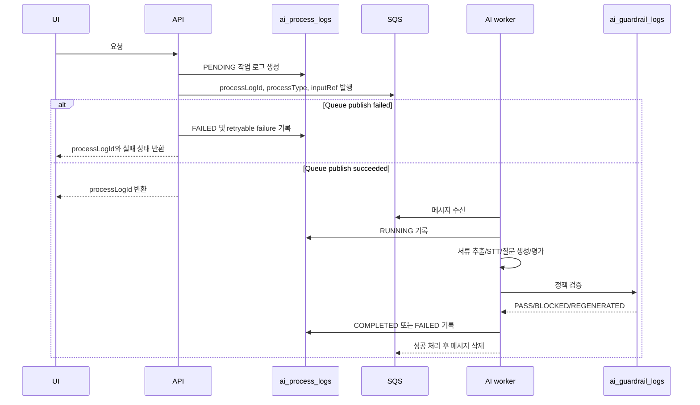

# Async AI Pipeline

> Source: `init/docs/00_source` 기준. Generated at 2026-06-27.

AI 처리와 비동기 작업의 실행 흐름을 정리한다.

## Pipeline Principles

- 장기 작업은 `ai_process_logs`에 작업 유형, 상태, 입력 참조, 출력 참조를 기록한다.
- AI 결과 저장 전 guardrail 정책 위반 여부를 검증하고 `ai_guardrail_logs`에 PASS/BLOCKED/REGENERATED를 기록한다.
- 실패한 작업은 `FAILED` 상태와 재시도 가능 사유를 화면에 노출한다.
- 임베딩은 원문 해시(`source_text_hash`)로 중복 생성을 방지하고, `ai_guardrail_logs`에 PASS를 기록한 뒤 저장한다. `ai_process_logs.outputRef`에는 원문 대신 `sourceTextHash`, `dedupeKey`, `duplicatePolicy=UPSERT_BY_SOURCE_TEXT_HASH`만 남긴다.

## Main Flows

## Async Endpoint Map

| API ID | Method | Path | Purpose | Related Tables |
| --- |--- |--- |--- |--- |
| API-028 | POST | /reports/{reportId}/evaluation-context | 평가 컨텍스트 구성 | companies, candidate_profiles, postings, criterion_tags, evaluation_criteria, applications, application_documents, interview_answers, evaluation_reports, report_scores, report_evidences, manual_evaluations, ai_process_logs |
| API-029 | POST | /reports/{reportId}/answer-evaluation | 답변 채점 및 근거 생성 | companies, candidate_profiles, postings, criterion_tags, evaluation_criteria, applications, interview_sessions, interview_answers, evaluation_reports, report_scores, report_evidences, manual_evaluations, ai_process_logs |
| API-030 | POST | /reports/{reportId}/communication-analysis | 비언어/음성 지표 보조 분석 | companies, candidate_profiles, file_assets, postings, applications, consent_records, evaluation_reports, report_scores, report_evidences, ai_process_logs |
| API-031 | POST | /reports/{reportId}/generate | 리포트 생성 | companies, candidate_profiles, postings, criterion_tags, evaluation_criteria, applications, application_documents, interview_sessions, interview_answers, evaluation_reports, report_scores, report_evidences, ai_process_logs |
| API-035 | POST | /company/interviews/evaluation-criteria/suggest | AI 평가 역량 태그 추천 | companies, postings, criterion_tags, evaluation_criteria, interview_sessions, ai_process_logs, embeddings |
| API-038 | POST | /company/interviews/questions/generate | JD 기반 직무 질문 생성 | companies, postings, criterion_tags, evaluation_criteria, question_bank, applications, interview_sessions, manual_evaluations, ai_process_logs |
| API-039 | POST | /company/interviews/question-sets | 면접 질문 목록 구성 | companies, postings, criterion_tags, evaluation_criteria, question_bank, application_documents, interview_sessions, manual_evaluations, ai_process_logs |
| API-045 | POST | /candidate/mock-interviews/questions/generate | 연습용 질문 목록 구성 | candidate_profiles, question_bank, interview_sessions, ai_process_logs |
| API-050 | POST | /candidate/mock-interviews/{sessionId}/stt | STT 처리 | candidate_profiles, file_assets, applications, interview_sessions, interview_answers, evaluation_reports, report_scores, report_evidences, ai_process_logs |
| API-051 | POST | /candidate/mock-interviews/{sessionId}/follow-up-question | 꼬리질문 생성 | candidate_profiles, postings, question_bank, applications, interview_sessions, interview_answers, follow_up_questions, ai_process_logs |
| API-051-TMP | POST | /candidate/mock-interviews/{sessionId}/follow-up-questions/insert | 생성된 꼬리질문을 면접 질문 흐름에 추가 (MVP 임시 브릿지) | question_bank, interview_sessions, interview_answers, ai_process_logs |
| API-057 | POST | /candidate/mock-interview/reports/{reportId}/generate | 피드백 리포트 생성 | candidate_profiles, postings, criterion_tags, evaluation_criteria, question_bank, applications, interview_sessions, interview_answers, evaluation_reports, report_scores, report_evidences, manual_evaluations, ai_process_logs |
| API-070 | POST | /candidate/interviews/{sessionId}/stt | STT 처리 | companies, candidate_profiles, file_assets, postings, applications, interview_sessions, interview_answers, ai_process_logs |
| API-071 | POST | /candidate/interviews/{sessionId}/follow-up-question | 꼬리질문 생성 | candidate_profiles, postings, question_bank, applications, application_documents, interview_sessions, interview_answers, follow_up_questions, ai_process_logs |
| API-071-TMP | POST | /candidate/interviews/{sessionId}/follow-up-questions/insert | 생성된 꼬리질문을 면접 질문 흐름에 추가 (MVP 임시 브릿지) | question_bank, interview_sessions, interview_answers, ai_process_logs |
| API-076 | POST | /candidate/documents/extract | 서류 텍스트 추출 | candidate_profiles, file_assets, applications, application_documents, manual_evaluations, ai_process_logs |
| API-079 | POST | /ai/guardrails/validate | AI 출력 안전성 검증 | evaluation_reports, report_scores, report_evidences, manual_evaluations, ai_process_logs, ai_guardrail_logs |
| API-080 | GET | /ai/jobs/{processLogId}/status | AI 작업 상태 조회 | ai_process_logs, ai_guardrail_logs |

## Status And Guardrail Contracts

- 장기 작업 생성 API는 `202 Accepted`와 `processLogId`를 반환한다.
- 화면은 `GET /ai/jobs/{processLogId}/status`로 `PENDING`, `RUNNING`, `COMPLETED`, `FAILED` 상태와 `output`, `failure`를 조회한다.
- 사용자 화면은 AI 상태를 한글로 표시한다. `PENDING=대기 중`, `RUNNING=처리 중`, `COMPLETED=완료`, `FAILED=실패`를 기본 라벨로 사용한다.
- `FAILED` 상태는 `failure.category`, `failure.reason`, `failure.retryable`을 포함한다.
- worker의 `finalSave`는 guardrail `PASS` 또는 `REGENERATED` 이후에만 실행된다.
- `BLOCKED` 결과는 최종 저장 없이 `ai_guardrail_logs`와 `ai_process_logs.status=FAILED`로 기록한다.
- C 화면에서 소비하는 AI draft output은 자동 저장하지 않는다. 평가 기준 추천은 `criteriaSuggestions`, JD 질문 생성은 `questionCandidates`, 질문 세트 구성은 `questionSetPreview`를 미리보기로 표시하고 사용자가 선택한 항목만 기존 C 저장 API로 반영한다.
